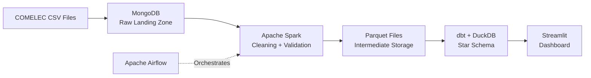
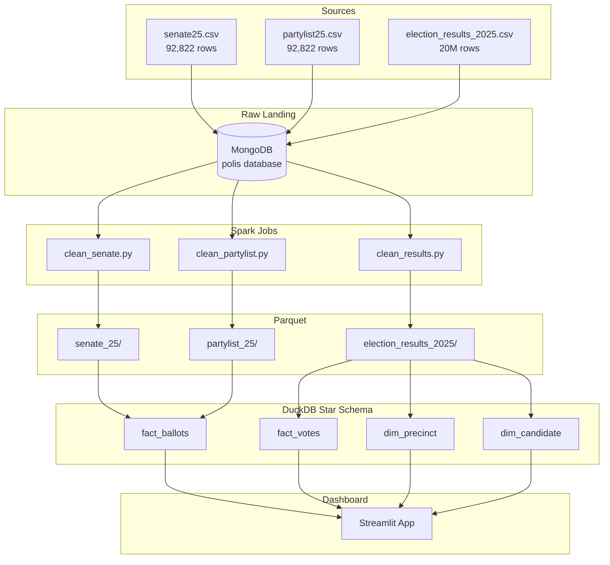
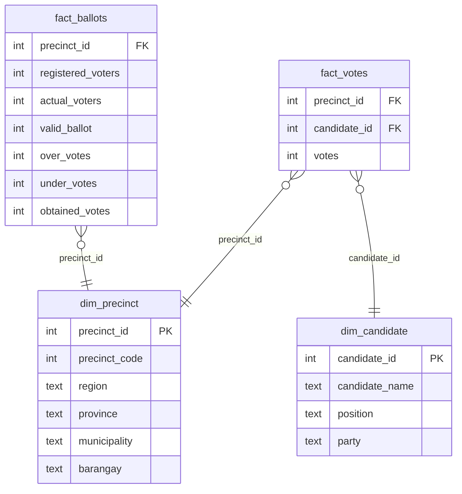

# Polis

A data engineering pipeline and dashboard for the 2025 Philippine Midterm Elections. Built to make election data accessible and easy to understand for everyone.


---

## The idea

Election data in the Philippines is public but hard to work with. COMELEC releases results as raw files that are difficult to explore without technical knowledge. Polis takes that raw data, runs it through a full data engineering pipeline, and presents it as an interactive dashboard anyone can use.

This is not an authoritative report. The data has known gaps documented below. Treat it as an accessible overview, not a definitive source.

---

## Dashboard

### Senate Results:


### Partylist Results:


### Candidate breakdown per region:


Three pages:

- **Senate:** Final rankings for all 66 candidates, top 12 winners, vote totals by region
- **Party List:** All 156 parties ranked, seats awarded, qualified party highlights
- **Regional Breakdown:** Pick any candidate or party and see how they performed across all 17 regions

---

## Pipeline



---

## Architecture



---

## Star schema



---

## Stack

| Layer | Tool |
|---|---|
| Ingestion | Python + PyMongo |
| Raw storage | MongoDB |
| Orchestration | Apache Airflow |
| Cleaning | Apache Spark (PySpark) |
| Intermediate storage | Parquet (uncompressed) |
| Warehouse | DuckDB |
| Transformation | dbt |
| Dashboard | Streamlit |
| Notebooks | Marimo |

---

## Data sources

| File | Format | Rows | Use |
|---|---|---|---|
| senate25 | Wide CSV | 92,822 | Ballot integrity, vote totals |
| partylist25 | Wide CSV | 92,822 | Ballot integrity, vote totals |
| election_results_2025 | Long CSV | 20,138,577 | Geographic distribution |

---

## How to run

**Prerequisites:** Docker Desktop, Python 3.11+

> This stack runs MongoDB, Spark, and Airflow simultaneously. Allocate at least 8GB RAM to Docker (Docker Desktop → Settings → Resources). Most modern laptops with 16GB total RAM can handle this comfortably.

**1. Start the stack**
```bash
docker compose up -d
```

**2. Ingest raw data**

Place the three source CSV files in `datasets/`:
- `senate25-final_updated.csv`
- `partylist25-final_updated.csv`
- `philippines_2025_elections_2025_results.csv`

Then trigger the Airflow DAG at `http://localhost:8080`. The DAG runs four steps in sequence:

| Step | Task | Runtime |
|---|---|---|
| 1 | Ingest raw CSVs into MongoDB | ~5 min |
| 2 | Clean senate25 via Spark | ~10 min |
| 3 | Clean partylist25 via Spark | ~10 min |
| 4 | Clean election_results_2025 via Spark | ~23 min |

**Why clean_results takes 23 minutes:** The long-format file has 20,138,577 documents in MongoDB — roughly 4x the size of the senate and partylist files combined. Spark reads all Senator and Party List rows (~17M after filtering local elections), runs three validation checks across the full dataset, deduplicates on `(PRECINCT_CODE, CANDIDATE_NAME)`, and writes uncompressed Parquet. The uncompressed write is intentional (ADR-008: Snappy codec incompatible with ARM/aarch64). MongoDB is also memory-capped at 2GB, so the read is throttled to avoid OOM kills — this was the primary bottleneck during development.

**3. Build the warehouse**
```bash
dbt run --project-dir polis
dbt test --project-dir polis
```

**4. Run the dashboard**
```bash
streamlit run streamlit/app.py
```

Open `http://localhost:8501`.

**Note:** Step 4 of the DAG (`clean_results`) runs for approximately 23 minutes due to the size of the long-format file (20M rows). MongoDB memory is capped at 2GB in `docker-compose.yml` — do not lower this or the job will crash.

---

## Known data gaps

**Vote total discrepancy:** The long-format file (`election_results_2025`) was scraped on 2025-08-21 before canvassing was complete. Vote totals in this file are lower than the official COMELEC certified results. The Senate and Party List pages use the wide-format files which reflect final certified results. The Regional Breakdown page uses the long-format file for geographic distribution only.

**Precinct coverage:** `dim_precinct` covers 77,615 of the 92,488 domestic precincts. The remaining 14,973 precincts reported ballots in the wide-format files but have no corresponding rows in the long-format scrape. Documented in `docs/data-quality.md`.

**Scope:** Local government elections (mayors, governors, councilors) are excluded. Polis covers Senatorial and Party List races only.

**OAV and LAV:** Overseas Absentee Voting and Local Absentee Voting are excluded from the Regional Breakdown map. They are included in the Senate and Party List vote totals.

---

## Future scope

- Live choropleth map using Philippine regional GeoJSON with Mapbox GL JS
- Full OAV and LAV inclusion in geographic breakdown
- Local government election results (requires additional data sourcing)
- Cloud deployment on a VM with full pipeline re-run capability
- `dim_precinct` built from wide-format files for complete precinct coverage
